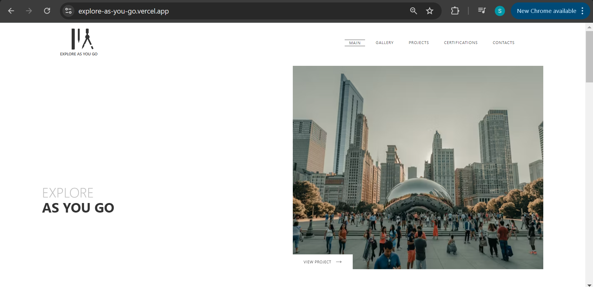

# Explore As You Go

[Go To Website](https://explore-as-you-go.vercel.app/)

A responsive tourist attraction website built using the MERN stack (MongoDB, Express, React, Node.js), styled with Tailwind CSS, and deployed using NGINX as a reverse proxy.

## Table of Contents

- [Features](#features)
- [Technologies](#technologies)
- [License](#license)

## Features

- User authentication
- Tourist attraction listings and detailed views
- Trip planning and itinerary management
- User reviews and ratings
- Interactive maps and directions
- Responsive design using Tailwind CSS
- Efficient data fetching and state management with React Query
- Real-time updates and notifications

## Technologies

- **Frontend**: React, Tailwind CSS, React Query
- **Backend**: Node.js, Express, MongoDB
- **Deployment**: NGINX, Docker

## License

This project is licensed under the MIT License - see the [LICENSE](LICENSE) file for details.
